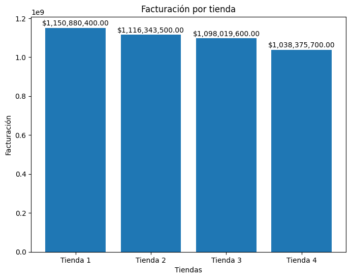

# alura-store-latam
Challenge Alura Store Latam

## Índice de archivos

| Contenido | Descripción |
|-----------|-------------|
| `AluraStoreLatam.ipynb` | Cuaderno de Jupyter donde se desarrolla el reto |
| `Proposito del Análisis` | Explicación del proyecto |
| `Estructura del Proyecto` | Organización del proyecto por puntos analizados |
| `Gráficos e Insights` | Resumen del análisis |
| `Instrucciones de ejecución` | Instrucciones sobre la ejecución del proyecto |

## Índice de contenidos
* [Challenge Store Latam](#Challenge-Store-Latam)
* [Proposito del Análisis](#Proposito-del-Análisis)
* [Estructura del Proyecto](#Estructura-del-Proyecto)
* [Gráficos e Insights](#Gráficos-e-Insights)
* [Instrucciones de ejecución](#Instrucciones-de-ejecución)
* [Tencologías implementadas](#Tencologías-implementadas)

## Challenge Store Latam

Este es un proyecto desarrollado para el curso Practicando Python para Data Scienca del programa formación de Alura Latam.

## Descripción

Proyecto finalizado y cargado para revisión.

## Proposito del Análisis

El objetivo es identificar la tienda menos eficiente y presentar una recomendación final basada en los datos.

## Estructura del Proyecto

### 1. Importación de datos

Importación de las bases de datos con la información de cada una de las tiendas a las que se realizará el análisis.

### 2. Análisis requeridos para la toma de decisiones

1. Análisis de facturación
2. Ventas por categoría
3. Calificación promedio de la tienda
4. Productos más y menos vendidos
5. Envío promedio por tienda

### 3. Gráficos e Insights

Se presentan algunos de los gráficos realizados.

### Representación de la facturación por tienda
Demostrando que la tienda numero 1 es la que mayor facturación tiene

### Representación de las ventas por tienda
Concluye que la categoría de productos que más ingresos genera es electrodomésticos.

### Instrucciones de uso

1. Conéctate a un entorno
Haz clic en el botón “Conectar” (esquina superior derecha) para habilitar la ejecución del código.

2. Ejecuta las celdas
Para ejecutar una celda, haz clic sobre ella y presiona Shift + Enter.

También puedes usar el botón ▶️ (reproducir) que aparece a la izquierda de cada celda.

3. Navega por el contenido
Puedes usar el menú de la izquierda (“📑” ícono de esquema) para saltar a secciones del notebook.

Si el notebook tiene visualizaciones, outputs o gráficos, se mostrarán justo debajo de cada celda ejecutada.

## Tencologías implementadas
